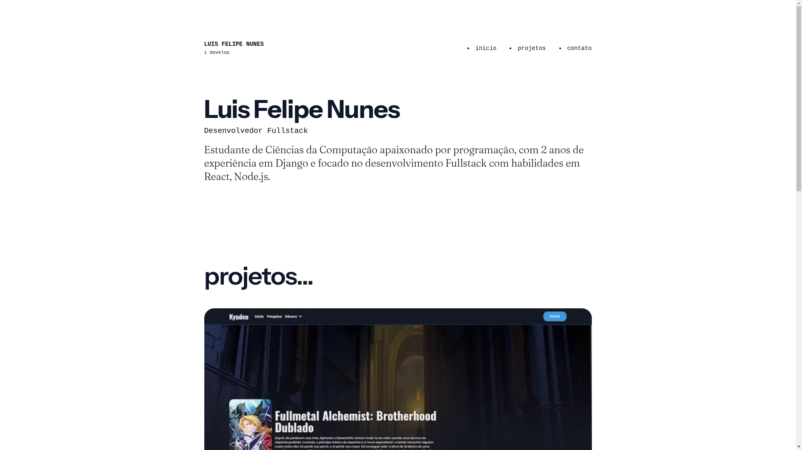

# Portfolio UI

## Tecnologias

Este projeto foi desenvolvido com as seguintes tecnologias:

- Next 13
- Tailwind
- DatoCMS

## Instalação e configuração
- Faça o clone deste repositório: `git clone`
- Certifique-se de ter o Node.js 18 e NPM 9.8.1 instalados em sua máquina.
- Copie o arquivo **.env.example** para **.env** na raiz do projeto e defina as variáveis de ambiente necessárias para o seu ambiente. 
- Execute `npm i` na pasta raiz do projeto para instalar todas dependências.
- Execute `npm run dev` para subir a aplicação em modo de desenvolvimento.
- No navegador acesse: http://localhost:3000
